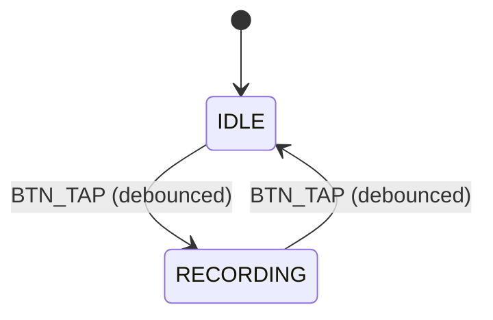

# SalesTag Smart Badge – Firmware Architecture

Derived from `docs/prd.md` and hardware reference `docs/hardware/README.md`.

## 1. System Overview

A battery‑powered ESP32‑S3 badge captures stereo audio via MAX9814 preamps, writes WAV files to microSD, and exposes optional BLE/Wi‑Fi provisioning. Power states optimize battery life while maintaining responsive user control via a single button and LED.

## 2. Hardware Integration Summary

- MCU: ESP32‑S3‑MINI‑1‑N8
- Audio Front‑End: 2× MAX9814 -> ESP32 ADC (I2S ADC mode)
- Storage: microSD over SPI (CS IO39, MOSI IO35, SCLK IO36, MISO IO37)
- UI: LED (IO40), SW2 button (IO4), SW1 enable/boot
- Power: USB‑C, MCP73831 charger, 3.3V regulator
  See `docs/hardware/README.md` for pinouts and details.

## 3. Firmware Components

### R0 Components (Completed) ✅
- App Coordinator: boot, lifecycle, state machine owner
- UI Controller: LED patterns, button debouncing and gestures
- Basic Storage: internal flash for R0 testing

### R1 Components (In Development)
- SD Storage Manager: mount/re‑mount, free‑space checks, directory creation
- WAV Writer: serializes PCM to WAV with proper headers
- Audio Capture Service: configures ADC/I2S, double‑buffered DMA, level/clip detection

### Future Components (Post-R1)
- Power Manager: state transitions (Idle/Record/Light/Deep), wake sources
- Time & Config: NVS + optional `/config.json`; SNTP or BLE time sync
- Connectivity (optional): BLE GATT; Wi‑Fi provisioning/AP when enabled
- OTA (post‑MVP): ESP‑IDF OTA hooks

## 4. Data Flow

Button → App State Machine → (start) Audio Capture → PCM buffers → WAV Writer → FATFS (SD)

Optional: Time Sync (BLE/Wi‑Fi) → RTC → Filename timestamps

## 5. State Machine

- Boot → Init → Idle
- Idle —[SW2 short]→ Recording
- Recording —[SW2 short | LowBatt | Error]→ Stopping → Idle
- Idle —[Timeout]→ Light Sleep —[SW2/Timer]→ Idle
- Extended inactivity → Deep Sleep —[SW2]→ Boot

## 6. Storage Layout

- `/records/YYYY/MM/DD/` directory tree
- Filenames: `YYYYMMDD_HHMMSS_{NN}.wav`
- `/logs/firmware.log` rolling text log
- Optional `/config.json` (mirrored in NVS)

## 7. Error Handling & Resilience

- Periodic WAV header updates; fsync on split/stop to prevent corruption
- Write watchdog monitors sustained throughput; back‑pressure to capture on SD stalls
- Safe stop on low battery; LED error pattern and log entry
- SD re‑mount attempts on transient I/O errors

## 8. Power Modes

- Active Recording: ADC + SD + UI; Wi‑Fi/BLE off (unless provisioning)
- Idle: peripherals downclocked; BLE advertising optional; LED heartbeat
- Light Sleep: wake on GPIO (SW2) or timer
- Deep Sleep: minimal consumption; wake on SW2

## 9. Interfaces

### 9.1 BLE (optional)

- Services: Device Info, Config (GATT), Control (start/stop), Time Sync
- Security: Just Works for MVP; passkey/Numeric Comparison in later revs

### 9.2 Wi‑Fi (optional)

- Provisioning: SoftAP + captive portal; store creds in NVS
- SNTP time sync on association

## 10. Configuration Model

- Backed by NVS; shadowed in `/config.json` when present
- Keys: `audio.*`, `rec.*`, `storage.*`, `ui.*`, `power.*`, `provisioning.*`

## 11. Build & Dependencies

- Toolchain: ESP‑IDF v5.x (recommended) or PlatformIO (ESP‑IDF framework)
- Components: FATFS, I2S/ADC, NVS, Wi‑Fi, BLE, SNTP, OTA (post‑MVP)
- Logging: ESP‑IDF logging to UART; mirrored to `/logs/firmware.log`

## 12. Security

- Store secrets in NVS; avoid plaintext in `/config.json`
- OTA image verification; TLS for any future uploads
- BLE/Wi‑Fi provisioning protected; limit exposure window

## 13. Observability & Testing

- On‑device logs with rotation; optional BLE log streaming
- Test plan:
  - Audio pipeline throughput tests at target rates
  - Power loss during record → file validity
  - SD stress (insert/remove, long recordings)

## 14. R1 Implementation Approach

### SD Card Integration Strategy
- **Mount Point**: `/sdcard` for FATFS filesystem
- **Directory Structure**: `/sdcard/rec/` for WAV files
- **SPI Configuration**: 
  - CS: GPIO39, MOSI: GPIO35, MISO: GPIO37, SCLK: GPIO36
  - SPI2_HOST, 10MHz clock, DMA enabled
- **Error Handling**: Graceful fallback when SD card unavailable
- **File Naming**: `rec_0001.wav` for R1 (timestamped naming in future)

### Integration Points
- **Storage Module**: Replace internal flash with SD card FATFS
- **Recorder**: Update to use SD card path and WAV writer
- **UI**: LED indicates SD card status and recording state
- **Main Loop**: SD card health monitoring and recovery

### Testing Strategy
- **Unit Tests**: SD card mount/unmount, directory creation
- **Integration Tests**: Button-to-WAV pipeline with SD card
- **Hardware Tests**: SD card insertion/removal, power cycling
- **Performance Tests**: WAV file creation speed and integrity
  - Sleep/wake latency, battery draw in each state
  - Provisioning flows (BLE/Wi‑Fi) where enabled

## 14. Roadmap Hooks

- Plug‑in codec layer for future compression
- Cloud sync worker when Wi‑Fi available
- On‑device VAD/keywords when power budget allows

---

This architecture aligns with `docs/prd.md` acceptance criteria and can evolve with future connectivity and analytics features.

## R0 Vertical Slice — Button → Record → LED

### Pin Map

- SW2 (User Button): IO4 (input, internal pull-up enabled)
- LED1 (Status LED): IO40 (output, active-high)

### RTOS Tasks

- input_control: debounced button handling (BTN_DOWN/BTN_UP events)
- audio_capture: minimal capture loop (stub acceptable for R0)
- file_writer: opens /rec/rec_0001.wav and writes PCM frames

### State Machine

- IDLE → (debounced BTN press) → RECORDING → (debounced BTN press) → IDLE

### Storage

- Filesystem: SPIFFS mounted at base_path "/rec"
- Output path: `/rec/rec_0001.wav`
- Format: WAV PCM mono 16 kHz 16-bit

### Test Seams

- HAL for GPIO (button/LED)
- HAL for I2S/capture (can be stubbed in R0)
- Pure logic modules for debounce and state transitions

### Observable Logs (for QA)

- BOOT: firmware start
- BTN_DOWN / BTN_UP with timestamps and debounce decision
- REC_START / REC_STOP with elapsed ms
- WAV_BYTES: bytes written periodically
- ERR_xxx: any mount/write/close errors
