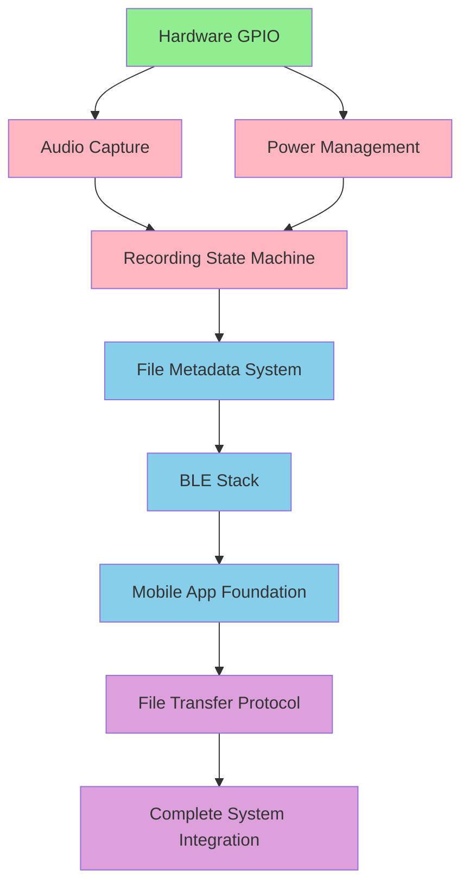

# SalesTag Component Integration Architecture

## Overview

This document defines the systematic approach for iterating through each component of the SalesTag system, establishing the optimal development sequence, dependencies, and integration testing strategy. Based on the current brownfield state and PRD requirements, this roadmap ensures each component builds upon stable foundations.

### Integration Philosophy

**Risk-Driven Development**: Start with highest-risk, foundational components first
**Incremental Value**: Each phase delivers working functionality that can be tested independently
**Dependency-First**: Build supporting infrastructure before dependent features
**Hardware-to-Software**: Establish hardware reliability before complex software features

## Component Dependency Analysis

### Current Foundation (Phase 0 - ✅ COMPLETE)
- ESP-IDF 5.2.2 build system
- Basic GPIO control (button/LED)
- SD card storage foundation
- FreeRTOS task infrastructure
- Development workflow established

### Critical Dependencies Identified



## Phased Integration Roadmap

## Phase 1: Core Hardware Foundation (Weeks 1-2)
**Priority**: CRITICAL - Foundation for all other components
**Risk Level**: HIGH - Hardware integration failures cascade through entire system

### 1.1 Real Audio Capture Implementation
**Current State**: Stubbed silence generation in `audio_capture.c`
**Target State**: Working MAX9814 microphone input via ESP32-S3 ADC

**Component Integration Steps**:
```c
// Integration sequence for audio_capture.c
1. ADC1 configuration for dual-channel microphone input
2. DMA buffer management for continuous audio sampling  
3. Audio quality validation (16kHz/16-bit stereo)
4. Integration with existing audio_capture_callback_t interface
5. Real-time performance testing with FreeRTOS task scheduling
```

**Success Criteria**:
- Captures clear speech from 3-foot distance
- No audio dropouts during 10-second recording
- ADC readings show proper signal levels (not clipped)
- Compatible with existing `recorder.c` state machine

**Testing Strategy**:
- Oscilloscope validation of ADC input signals
- WAV file analysis for frequency response and noise floor
- Concurrent GPIO operation (button press during recording)

### 1.2 Recording State Machine Integration  
**Current State**: Basic recorder framework exists, but not integrated with main.c
**Target State**: Full recording workflow with 10-second auto-stop

**Component Integration Steps**:
```c
// Integration sequence for main.c -> recorder.c
1. Replace simple GPIO loop with recorder state machine
2. Implement 10-second automatic recording termination
3. Add recording session management (start/stop/status)
4. Integrate LED status indication with recording states
5. Error handling for SD card full / audio capture failures
```

**Dependencies**: Audio capture implementation (1.1)
**Interface**: Button press → recorder_start() → 10sec timeout → recorder_stop()

### 1.3 Enhanced Power Management
**Current State**: Basic GPIO control only
**Target State**: Battery monitoring and optimized power consumption

**Component Integration Steps**:
```c
// New component: power_management.c
1. ADC channel for battery voltage monitoring
2. Deep sleep entry/exit with 2-second wake-up requirement
3. Power state coordination with recording operations
4. LED battery level indication (low battery warnings)
5. USB charging detection and status
```

**Critical Integration Point**: Must not interfere with audio ADC channels
**Power Budget Target**: 6+ hour operation per PRD NFR1

## Phase 2: Data & Storage Enhancement (Weeks 3-4)  
**Priority**: HIGH - Required for mobile app integration
**Risk Level**: MEDIUM - File system operations are well-understood

### 2.1 File Metadata System Implementation
**Current State**: Basic WAV files with sequential naming
**Target State**: JSON metadata matching PRD schema

**Component Integration Steps**:
```json
// Target metadata structure per PRD
{
  "file_id": "st_20250821_143022_001",
  "timestamp_utc": "2025-08-21T14:30:22.123Z", 
  "duration_ms": 10000,
  "device_info": {
    "device_id": "ST-001A2B3C",
    "battery_level": 75
  },
  "transfer_status": "pending"
}
```

**Implementation Strategy**:
1. Extend `wav_writer.c` to generate companion .json files
2. Add device ID generation and persistence in NVS
3. RTC integration for accurate timestamps
4. File validation and corruption recovery
5. Storage space management (automatic cleanup)

### 2.2 Audio File Encryption (AES-256)
**Current State**: Plain WAV files on SD card
**Target State**: Encrypted audio meeting PRD FR11 requirements

**Component Integration Steps**:
```c
// New component: crypto.c
1. AES-256 encryption integration with mbedTLS (ESP-IDF included)
2. Key derivation from device unique ID + user PIN
3. Encrypted file format with integrity checking
4. Backward compatibility with existing WAV reader infrastructure
5. Performance testing (encryption must not impact real-time recording)
```

**Critical Decision**: Encrypt during write vs. encrypt after recording complete
**Recommendation**: Streaming encryption during write to minimize storage requirements

## Phase 3: BLE Communication Stack (Weeks 5-7)
**Priority**: HIGH - Mobile integration dependency
**Risk Level**: HIGH - Complex protocol implementation with timing constraints

### 3.1 BLE Peripheral Infrastructure
**Current State**: No BLE implementation
**Target State**: ESP32-S3 advertising as "SalesTag" with secure pairing

**Component Integration Steps**:
```c
// New component: ble_manager.c
1. ESP-IDF BLE stack initialization and configuration
2. Service and characteristic definition for file transfer
3. Secure bonding implementation with PIN verification
4. Connection state management and reconnection logic
5. Integration with existing ui.c for LED status indication
```

**BLE Service Architecture**:
- **Device Info Service**: Battery, storage, firmware version
- **File Transfer Service**: Metadata exchange, chunk transfer, status
- **Control Service**: Recording commands, device settings

### 3.2 File Transfer Protocol Implementation
**Current State**: Files stored locally only
**Target State**: Reliable BLE file transfer with resume capability

**Component Integration Steps**:
```c
// Integration with existing file system
1. File chunking algorithm (target: 512-byte chunks for BLE MTU)
2. Transfer queue management with priority system
3. Checksum validation and retry logic
4. Transfer progress tracking and status reporting
5. Concurrent transfer + recording capability testing
```

**Protocol Design**:
```c
typedef struct {
    uint16_t chunk_id;
    uint16_t total_chunks; 
    uint32_t file_size;
    uint8_t data[512];
    uint32_t crc32;
} file_chunk_t;
```

**Success Criteria**: >95% transfer success rate per PRD NFR3

## Phase 4: Mobile Application Foundation (Weeks 8-10)
**Priority**: MEDIUM - Enables end-user value but device works standalone
**Risk Level**: MEDIUM - React Native development is well-established

### 4.1 React Native App Scaffolding
**Current State**: No mobile app exists
**Target State**: Basic app with BLE connectivity and audio playback

**Component Integration Steps**:
```javascript
// Technology stack decisions
1. React Native with TypeScript for cross-platform development
2. React Native BLE Manager for ESP32-S3 communication
3. SQLite for offline-first data storage
4. React Native Audio for WAV file playback
5. Supabase client for authentication foundation
```

**App Architecture**:
```
src/
├── screens/           # Main UI screens per PRD design
├── services/          # BLE, audio, sync services  
├── components/        # Reusable UI components
├── hooks/             # Custom React hooks for state management
├── types/             # TypeScript interfaces matching device schemas
└── utils/             # Crypto, file management utilities
```

### 4.2 BLE Communication Client
**Current State**: Device-side BLE ready from Phase 3
**Target State**: Mobile app discovers, pairs, and transfers files

**Component Integration Steps**:
```javascript
// BLE service integration
1. Device discovery and connection management
2. Service and characteristic mapping to device BLE implementation
3. File transfer client with progress tracking
4. Connection state management and error recovery
5. Background operation for file sync
```

**Critical Integration**: Must match device BLE protocol exactly

### 4.3 Audio Playback and File Management
**Current State**: Device creates audio files
**Target State**: Mobile app plays, organizes, and manages recordings

**Component Integration Steps**:
```javascript
// Audio and file management
1. WAV file decryption and validation
2. Audio playbook with waveform visualization
3. Recording library with search and organization
4. Local SQLite storage matching device metadata schema
5. Export and sharing functionality
```

## Phase 5: Complete System Integration (Weeks 11-12)
**Priority**: HIGH - Validates entire system functionality
**Risk Level**: MEDIUM - Integration testing of complex interactions

### 5.1 End-to-End Workflow Testing
**Integration Test Scenarios**:
1. **Complete Recording Cycle**: Button press → record → encrypt → store → transfer → mobile playback
2. **Concurrent Operations**: Recording while transferring previous files
3. **Power Management**: Deep sleep → wake → record → return to sleep
4. **Error Recovery**: Connection loss during transfer, SD card full, low battery
5. **Security Validation**: Encrypted file integrity, unauthorized device pairing prevention

### 5.2 Performance Optimization
**Optimization Targets**:
- Battery life: 6+ hours continuous operation
- BLE transfer speed: Complete 10-second file in <30 seconds
- Wake-up latency: <2 seconds from deep sleep
- Audio quality: Clear speech recognition at 3-foot distance

### 5.3 Field Testing Preparation
**Validation Requirements**:
- Real-world audio environments (outdoor, indoor, noisy)
- Various smartphone models (iOS/Android BLE compatibility)
- Extended operation testing (8-hour field simulation)
- User interface validation with actual sales representatives

## Integration Testing Strategy

### Component-Level Testing
Each phase includes comprehensive testing before proceeding:

**Hardware Components**:
- Oscilloscope validation of electrical signals
- Power consumption measurement under load
- Temperature and vibration stress testing

**Software Components**:
- Unit tests for all new modules
- FreeRTOS task timing and priority validation  
- Memory leak detection and flash usage optimization

**Integration Testing**:
- Cross-component interface validation
- Error condition testing and recovery
- Performance benchmarking against PRD requirements

### Continuous Integration Approach
```yaml
# Automated testing pipeline for each phase
Hardware-in-Loop Tests:
  - Audio capture quality validation
  - BLE communication reliability
  - Power consumption measurement
  
Software Integration Tests:
  - Component interface compatibility
  - Error handling and recovery
  - Performance regression detection
```

## Risk Mitigation Strategies

### High-Risk Components
1. **Audio Capture (Phase 1.1)**: Hardware dependencies, real-time constraints
   - **Mitigation**: Early hardware validation, oscilloscope testing, audio analysis tools

2. **BLE File Transfer (Phase 3.2)**: Complex protocol, timing sensitive  
   - **Mitigation**: Incremental protocol testing, BLE analyzer tools, connection stability testing

3. **Mobile App BLE Integration (Phase 4.2)**: Cross-platform compatibility
   - **Mitigation**: Multiple device testing, BLE library validation, connection state management

### Dependency Management
- **Parallel Development**: Phase 4 (mobile app) can begin while Phase 3 (BLE) is in progress
- **Fallback Options**: Each phase must work independently for incremental validation
- **Interface Contracts**: Well-defined APIs between components prevent integration delays

## Success Metrics by Phase

| Phase | Key Performance Indicators | Validation Method |
|-------|----------------------------|-------------------|
| Phase 1 | Audio quality, 10-sec recording, battery life | Oscilloscope, WAV analysis, power meter |
| Phase 2 | File encryption, metadata accuracy | File validation, corruption testing |
| Phase 3 | BLE connectivity, transfer success rate >95% | BLE analyzer, transfer reliability testing |
| Phase 4 | Mobile app functionality, user experience | Device testing, usability validation |
| Phase 5 | Complete system performance | Field testing, PRD compliance validation |

This component integration architecture provides a systematic roadmap that builds stable foundations first, minimizes risk through incremental development, and ensures each phase delivers testable value toward the complete SalesTag solution.